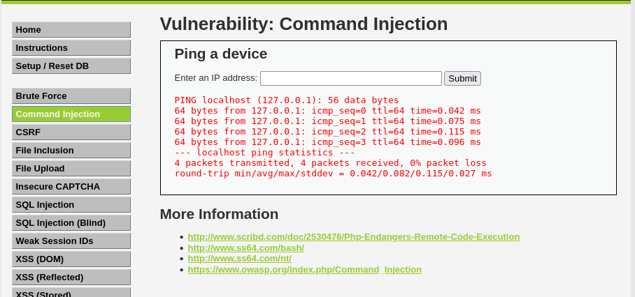
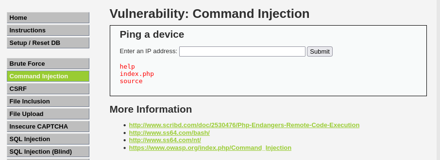

# Ejercicio 2: Command Injection

Este módulo demuestra cómo una aplicación web puede permitir la ejecución de comandos arbitrarios en el sistema operativo del servidor debido a una validación insuficiente de la entrada del usuario.

## 📑 Descripción del Escenario

La aplicación presenta una funcionalidad diseñada para que el usuario pueda realizar un "Ping" a un dispositivo introduciendo una dirección IP o un dominio. El problema reside en que el servidor concatena directamente la entrada del usuario con el comando del sistema operativo (shell) sin el filtrado adecuado.

## 🛠️ Herramientas Utilizadas

- DVWA (Niveles Low, Medium y High).
- Docker para el despliegue del servidor vulnerable.
- Payloads de concatenación: Uso del carácter pipe (|) para inyectar comandos secundarios.

## 🚀 Ejecución del Ataque

En este ejercicio, aprovechamos que el backend está ejecutando un comando similar a ping <input>. Al insertar un operador de tubería, forzamos la ejecución de un segundo comando tras el primero.

Payload utilizado:

El siguiente comando funciona eficazmente en los niveles Low, Medium y High según el tutorial seguido:

```
| ls
```

Proceso paso a paso:

- Introducimos localhost en el formulario para verificar el funcionamiento normal de la herramienta (Ping).
- Posteriormente, inyectamos el comando | ls en el campo de texto.
- El servidor devuelve el listado de archivos del directorio actual, confirmando la vulnerabilidad de ejecución remota de comandos.

## 📸 Resultados en el Entorno

Como se puede observar en las capturas realizadas en nuestro entorno controlado:

- La entrada estándar ejecuta el ping correctamente.

  

- Al añadir el payload, logramos listar el contenido del directorio del servidor Docker, lo que demuestra control sobre el sistema operativo subyacente.

  

## ✅ Conclusión y Mitigación

Esta vulnerabilidad es extremadamente crítica ya que permite a un atacante tomar el control total del servidor. Para corregirla, se deben seguir las siguientes mejores prácticas de seguridad:

- Validación estricta: Permitir solo caracteres permitidos (ej. solo números y puntos para IPs).
- Funciones seguras: Evitar funciones de shell como exec() o shell_exec() en PHP con datos del usuario.
- Principio de mínimo privilegio: Ejecutar el servidor web con un usuario que no tenga permisos de ejecución de comandos sensibles.

Recuerda: Este ejercicio se ha realizado en un entorno controlado con fines exclusivamente educativos.