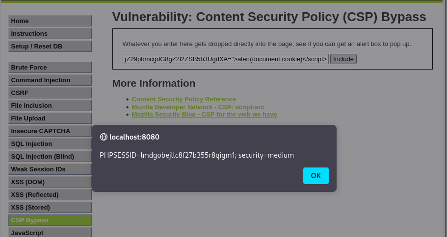

# Ejercicio 3: Content Security Policy (CSP) Bypass (Nivel: Medium)

Este módulo trata sobre cómo saltarse las políticas de seguridad de contenido (CSP) diseñadas para prevenir la ejecución de scripts maliciosos (XSS) mediante el uso de "nonces".

## 📑 Descripción del Escenario

En el nivel Medium, la aplicación utiliza un nonce (un número o cadena única) que debe coincidir tanto en la cabecera de la política CSP como en la etiqueta del script para que este pueda ejecutarse. El fallo de seguridad aquí reside en que el valor del nonce es estático (no cambia entre peticiones), lo que permite a un atacante conocerlo de antemano e incluirlo en su payload.

## 🛠️ Herramientas Utilizadas

- DVWA (Desplegado en Docker).
- Navegador Web: Para la inyección del script y visualización del alert.
- Payload de Javascript: Diseñado para incluir el token nonce estático.

## 🚀 Ejecución del Ataque

El objetivo es lograr que aparezca un cuadro de alerta con las cookies de sesión. Al inspeccionar el código o seguir la guía, identificamos que el nonce utilizado es siempre el mismo: TmV2ZXIgZ29pbmcgdG8gZ2l2ZSB5b3UgdXA=.

Payload utilizado:

Copiamos e introducimos el siguiente código en el formulario de la web:

```html
<script nonce="TmV2ZXIgZ29pbmcgdG8gZ2l2ZSB5b3UgdXA=">alert(document.cookie)</script>
```

Proceso:

- Navegamos a la sección de CSP Bypass.
- Introducimos el payload anterior en el campo de entrada.
- Al hacer clic en "Include", el navegador acepta el script como legítimo porque el nonce coincide con el configurado en la política del servidor.

## 📸 Evidencia de Explotación

Como se muestra en la captura de pantalla:

- Se ha introducido con éxito el script con el nonce correspondiente.
- El navegador muestra una ventana emergente (alert) con el contenido: PHPSESSID=lmdgobejllc8f27b355r8qigm1; security=medium.

  

## ✅ Conclusión y Mitigación

El uso de un nonce estático anula completamente el propósito de CSP, ya que se vuelve predecible para el atacante. Para mitigar esta vulnerabilidad se debe:

- Generar nonces dinámicos: El valor debe ser una cadena aleatoria criptográficamente segura y única para cada petición HTTP.
- Implementar políticas estrictas: Evitar el uso de 'unsafe-inline' siempre que sea posible y preferir la carga de scripts desde dominios de confianza bien configurados.

Recuerda: Este ejercicio se ha realizado en un entorno controlado con fines exclusivamente educativos.