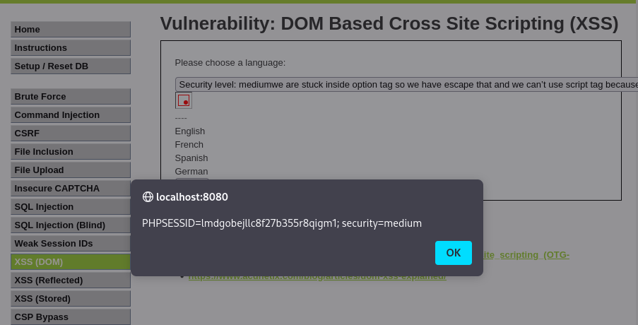

# Ejercicio 5: DOM Based Cross Site Scripting (XSS) - (Nivel: Medium)

En este módulo se analiza una vulnerabilidad de Cross Site Scripting basada en el DOM, donde la ejecución del script malicioso ocurre en el lado del cliente al manipular el entorno del documento en el navegador.

## 📑 Descripción del Escenario

En el nivel Medium, la aplicación intenta mitigar ataques XSS filtrando o bloqueando la etiqueta <script>. Además, la entrada del usuario (la selección del idioma) se refleja dentro de una etiqueta <option> de un menú desplegable, lo que añade una capa de dificultad al requerir "escapar" del contexto HTML original antes de ejecutar el código malicioso.

## 🛠️ Herramientas Utilizadas

- DVWA (Desplegado en Docker).
- Navegador Web: Para la manipulación de parámetros en la URL y visualización de resultados.
- Payload de evento onerror: Utilizado para evadir el bloqueo de etiquetas de script.

## 🚀 Ejecución del Ataque

Para superar las restricciones del nivel Medium, es necesario cerrar las etiquetas HTML existentes (</option></select>) e inyectar un elemento alternativo que ejecute JavaScript sin usar la palabra prohibida "script".

Payload utilizado:

Se inyecta el siguiente código a través del parámetro default en la URL:

```
" ></option></select>
```

Proceso paso a paso:

- Se selecciona un idioma en la interfaz.
- En la URL, se sustituye el valor del parámetro default= por el payload anterior.
- Al cargar la página, el navegador interpreta que la etiqueta <select> ha terminado, intenta cargar una imagen inexistente (src=x) y, al fallar, ejecuta el manejador de errores onerror, disparando el JavaScript.

## 📸 Evidencia de Explotación

Como se aprecia en la captura:

- Se ha logrado romper la estructura de la página original.
- El navegador muestra con éxito un cuadro de alerta con el contenido de la sesión: PHPSESSID=lmdgobejllc8f27b355r8qigm1; security=medium.

  

## ✅ Conclusión y Mitigación

Este ejercicio demuestra que los filtros basados en "listas negras" (como bloquear solo la etiqueta <script>) son insuficientes, ya que existen múltiples formas de ejecutar código en el navegador. Para prevenir ataques DOM-XSS se recomienda:

- Sanitización en el cliente: Utilizar bibliotecas seguras para manipular el DOM que escapen automáticamente caracteres especiales.
- Uso de Content Security Policy (CSP): Configurar políticas que prohíban la ejecución de scripts inline y manejadores de eventos como onerror.
- Evitar sinks peligrosos: No utilizar funciones como innerHTML o document.write() con datos provenientes de la URL o del usuario.

Recuerda: Este ejercicio se ha realizado en un entorno controlado con fines exclusivamente educativos.