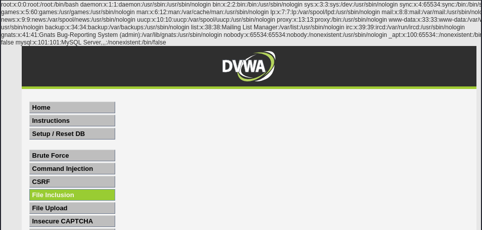

# Ejercicio 6: File Inclusion (Niveles: Low & Medium)

Este módulo permite explorar vulnerabilidades de inclusión de archivos, donde una aplicación web incluye archivos en su ejecución basándose en una entrada de usuario sin la debida validación.

## 📑 Descripción del Escenario

La aplicación utiliza un parámetro GET llamado page para determinar qué archivo debe cargar y mostrar en la interfaz. Tanto en el nivel Low como en el Medium, la falta de filtros adecuados permite realizar un ataque de Local File Inclusion (LFI) para leer archivos sensibles del sistema operativo del servidor.

## 🛠️ Herramientas Utilizadas

- DVWA (Desplegado en Docker).
- Navegador Web: Para la manipulación de parámetros en la URL.

## 🚀 Ejecución del Ataque

El objetivo es acceder al archivo /etc/passwd del contenedor Docker, el cual contiene información sobre los usuarios del sistema.

Payload utilizado:

Modificamos la URL original del ejercicio añadiendo la ruta absoluta del archivo deseado al parámetro page:

```
http://localhost:8080/vulnerabilities/fi/?page=/etc/passwd
```

Proceso paso a paso:

- Navegamos a la sección de File Inclusion.
- Observamos que la URL por defecto carga include.php.
- Sustituimos include.php por /etc/passwd directamente en la barra de direcciones del navegador.
- El servidor procesa la petición e incluye el contenido del archivo del sistema dentro de la página web.

## 📸 Evidencia de Explotación

Como se observa en la captura:

- La parte superior de la interfaz de DVWA muestra el contenido completo del archivo /etc/passwd.

  

Se pueden identificar usuarios del sistema como root, daemon, bin, y el servicio mysql.

El ataque funciona con éxito tanto en dificultad Low como en Medium debido a la configuración del servidor.

## ✅ Conclusión y Mitigación

La inclusión de archivos basada en entradas del usuario es una vulnerabilidad crítica que puede llevar a la exposición de datos sensibles o incluso a la ejecución remota de código (RCE). Para mitigar este riesgo se recomienda:

- Uso de Listas Blancas (Allowlists): Definir explícitamente qué archivos se pueden incluir y rechazar cualquier otra entrada.
- Deshabilitar la inclusión remota: Configurar PHP (allow_url_include = Off) para evitar ataques de Remote File Inclusion (RFI).
- Validación de Rutas: Utilizar funciones que resuelvan la ruta real del archivo y aseguren que se encuentra dentro de un directorio permitido.

Recuerda: Este ejercicio se ha realizado en un entorno controlado con fines exclusivamente educativos.