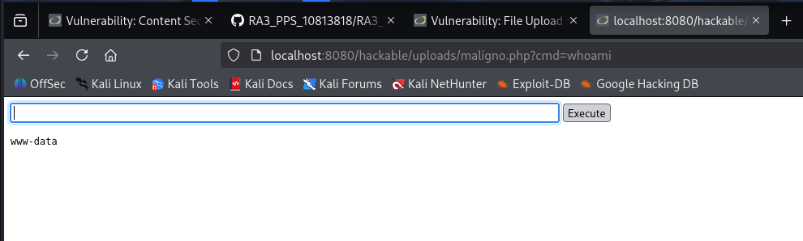

# Ejercicio 7: File Upload (Nivel: Medium)

Este módulo demuestra cómo una validación de archivos mal implementada permite a un atacante subir scripts maliciosos (como una Web Shell) para ejecutar comandos directamente en el servidor.

## 📑 Descripción del Escenario

En el nivel Medium, la aplicación intenta bloquear la subida de archivos PHP verificando el tipo de contenido (Content-Type) declarado en la petición HTTP. Sin embargo, esta medida es insuficiente ya que el atacante puede interceptar la petición y modificar este valor para engañar al servidor, haciéndole creer que el archivo es una imagen legítima.

## 🛠️ Herramientas Utilizadas

- DVWA (Desplegado en Docker).
- Web Shell PHP: Un script sencillo para ejecutar comandos del sistema (ej. maligno.php).
- Herramientas de Desarrollador (Network Tab) o Burp Suite: Para interceptar y modificar el Content-Type.

## 🚀 Ejecución del Ataque

El objetivo es subir un archivo PHP que nos permita ejecutar el comando whoami en el servidor Docker.

### 1. Preparación y Bypass

Intentar subir un archivo .php directamente fallará. Para evadir el filtro, seguimos la técnica de Aftab Sama:

- Seleccionamos el archivo malicioso (ej. maligno.php).
- Interceptamos la petición de subida.
- Cambiamos el encabezado de:
  Content-Type: application/x-php
  a:
  Content-Type: image/png.
- El servidor acepta el archivo y lo guarda en la ruta de subidas.

### 2. Ejecución de Comandos

Una vez subido, accedemos al archivo a través de la URL y pasamos el comando deseado como parámetro:

```
http://localhost:8080/hackable/uploads/maligno.php?cmd=whoami
```

## 📸 Evidencia de Explotación

Como se observa en la captura:

- Se ha accedido con éxito al archivo maligno.php alojado en el servidor.
- Al ejecutar el parámetro ?cmd=whoami, el servidor responde con: www-data.
- Esto confirma que tenemos ejecución remota de comandos (RCE) con los privilegios del servicio web.

  

## ✅ Conclusión y Mitigación

Confiar en el Content-Type proporcionado por el cliente es un error grave de seguridad. Para mitigar esta vulnerabilidad de forma efectiva, se deben implementar las siguientes medidas:

- Renombrado de archivos: Cambiar el nombre de los archivos subidos a uno aleatorio y sin extensiones peligrosas.
- Verificación de firmas (Magic Bytes): Validar el contenido real del archivo analizando sus primeros bytes en lugar de confiar en la extensión o el encabezado HTTP.
- Almacenamiento seguro: Guardar los archivos fuera de la raíz del servidor web o en un servidor de archivos dedicado sin permisos de ejecución.

Recuerda: Este ejercicio se ha realizado en un entorno controlado con fines exclusivamente educativos.