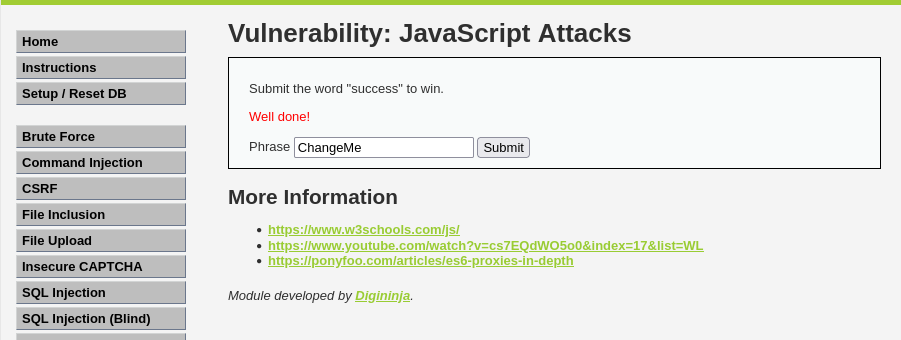

# Ejercicio 8: JavaScript Attacks (Nivel: Medium)

Este módulo explora cómo las protecciones de seguridad basadas exclusivamente en el lado del cliente (JavaScript) pueden ser analizadas y eludidas por un atacante, ya que el código es totalmente visible y manipulable desde el navegador.

## 📑 Descripción del Escenario

El objetivo del reto es enviar la palabra "success" para ganar. El formulario requiere dos parámetros: phrase y token. En el nivel Medium, el script de la página genera un token de seguridad basado en la frase introducida para evitar que el usuario simplemente cambie el texto manualmente sin generar un token válido.

## 🛠️ Herramientas Utilizadas

- DVWA (Desplegado en Docker).
- Consola del Navegador / Inspeccionar Elemento: Para analizar el código fuente de JavaScript y manipular las variables en tiempo de ejecución.
- Lógica de Inversión de Cadenas: Para replicar el algoritmo de generación de tokens del servidor.

## 🚀 Ejecución del Ataque

Al analizar el código fuente de la página para el nivel Medium, se identifica que el algoritmo para generar el token es el siguiente:

- Se toma la frase deseada (phrase).
- Se invierte el orden de los caracteres.
- Se añade el prefijo "XX" y el sufijo "XX" al resultado.

### Determinación del Payload

Para ganar con la frase "success", debemos calcular manualmente el token correspondiente:

- Frase original: success
- Reversa de la frase: sseccus
- Token final: XXsseccusXX

Proceso de explotación:

- Accedemos a la sección JavaScript Attacks y configuramos la seguridad en Medium.
- Abrimos las herramientas de desarrollador del navegador.
- Podemos manipular directamente el valor de la frase y el token antes de enviar el formulario mediante la consola o interceptando la petición:
  - phrase = "success"
  - token = "XXsseccusXX"
- Enviamos la petición con estos valores.

## 📸 Evidencia de Explotación

Como se observa en la captura:

- Se ha introducido la frase modificada.
- Tras el envío, la aplicación muestra el mensaje en rojo: "Well done!", indicando que el token generado manualmente ha sido aceptado por el servidor como válido.

  

## ✅ Conclusión y Mitigación

Este ejercicio demuestra que la lógica de seguridad nunca debe residir únicamente en el cliente. Cualquier validación o generación de tokens en JavaScript puede ser replicada por un atacante. Para mitigar estos riesgos:

- Validación en el servidor: Todas las entradas y tokens deben ser verificados en el backend, donde el atacante no tiene control sobre el código de ejecución.
- Uso de secretos: Si se utilizan tokens, estos deben generarse con claves secretas que solo el servidor conozca (como HMAC).

**Nota:** Este ejercicio forma parte de la unidad didáctica RA3.2 y se ha realizado en un entorno controlado con fines educativos.