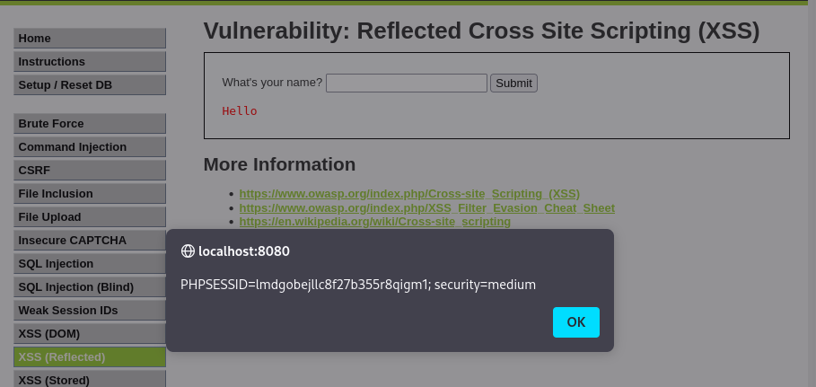

# Ejercicio 9: Reflected Cross Site Scripting (XSS) - (Nivel: Medium)

Este módulo demuestra una vulnerabilidad de XSS reflejado, donde un script malicioso es inyectado en una solicitud HTTP y "reflejado" de vuelta por la aplicación web hacia el navegador del usuario.

## 📑 Descripción del Escenario

En el nivel Medium, la aplicación suele implementar filtros básicos para intentar bloquear etiquetas comunes como <script>. Sin embargo, estos filtros a menudo son insuficientes porque no contemplan otros métodos de ejecución de JavaScript a través de atributos de eventos en otras etiquetas HTML.

## 🛠️ Herramientas Utilizadas

- DVWA (Desplegado en Docker).
- Navegador Web: Para la inyección del payload en el formulario.
- Payload de evento onerror: Utilizado para evadir filtros que buscan específicamente la etiqueta de script.

## 🚀 Ejecución del Ataque

El objetivo es lograr que el navegador ejecute un código JavaScript que muestre las cookies de sesión actuales mediante un cuadro de alerta.

Payload utilizado:

Se introduce el siguiente código en el campo de texto "What's your name?":

```

```

Proceso paso a paso:

- Se accede a la sección de XSS (Reflected).
- Se introduce el payload en el campo de entrada. Al usar una etiqueta  con un origen inválido (src=x), se fuerza la ejecución del manejador de errores onerror.
- Al hacer clic en "Submit", el servidor refleja la entrada en la página.
- El navegador intenta renderizar la imagen, falla, y ejecuta inmediatamente el comando alert(document.cookie).

## 📸 Evidencia de Explotación

Como se muestra en la captura:

- La inyección ha tenido éxito a pesar del nivel de seguridad Medium.
- Se visualiza una ventana emergente (alert) con la información de sesión: PHPSESSID=lmdgobejllc8f27b355r8qigm1; security=medium.

  

## ✅ Conclusión y Mitigación

Este ejercicio resalta que confiar en el filtrado de palabras clave específicas es una estrategia de defensa débil. Para mitigar el XSS reflejado de manera efectiva, se recomienda:

- Escapado de salida (Output Encoding): Convertir todos los caracteres especiales (como < y >) en sus equivalentes HTML (como &lt; y &gt;) antes de mostrarlos en la página.
- Validación de entrada: Asegurarse de que los datos recibidos coincidan con el formato esperado.
- Content Security Policy (CSP): Implementar cabeceras CSP que deshabiliten la ejecución de scripts inline.

Recuerda: Este ejercicio forma parte de la unidad RA3.2 y se realiza en un entorno controlado con fines educativos.