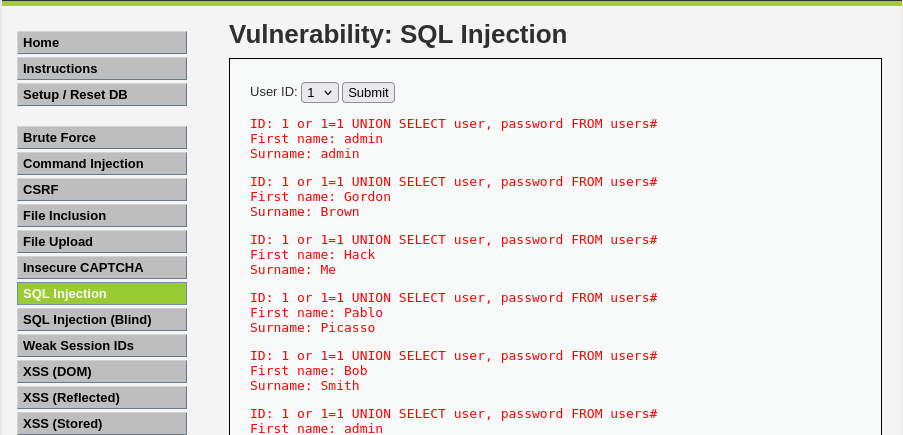

# Ejercicio 10: SQL Injection (Nivel: Medium)

Este módulo consiste en explotar una vulnerabilidad de inyección SQL para extraer información sensible de la base de datos, como nombres de usuario y sus respectivas contraseñas.

## 📑 Descripción del Escenario

En el nivel Medium, la aplicación utiliza el método POST para enviar los datos y aplica filtros para escapar las comillas (como mysql_real_escape_string()). Sin embargo, el valor del parámetro id se inserta directamente en la consulta SQL sin estar rodeado por comillas en el código backend. Esto permite realizar una inyección numérica sin necesidad de usar caracteres especiales filtrados.

## 🛠️ Herramientas Utilizadas

- DVWA (Desplegado en Docker).
- Burp Suite o Herramientas de Desarrollador del Navegador: Necesarias para interceptar la petición POST y modificar el parámetro id, ya que la interfaz presenta un menú desplegable limitado.
- Payloads SQL: Técnicas de unión (UNION SELECT) para recuperar datos de tablas arbitrarias.

## 🚀 Ejecución del Ataque

El objetivo es evadir la restricción del menú desplegable para ejecutar una consulta que devuelva todos los registros de la tabla de usuarios.

Payload utilizado:

Al interceptar la petición POST, se sustituye el valor de id por el siguiente comando:

```sql
1 or 1=1 UNION SELECT user, password FROM users#
```

Proceso paso a paso:

- Se selecciona cualquier ID en el menú desplegable y se pulsa "Submit".
- Se intercepta la petición HTTP POST enviada al servidor.
- Se modifica el cuerpo de la petición cambiando el valor de id por el payload mencionado.
- El servidor ejecuta la consulta maliciosa y devuelve la información de la tabla users en la página de resultados.

## 📸 Evidencia de Explotación

Como se observa en la captura:

- La inyección ha permitido listar múltiples usuarios: admin, Gordon, Hack, Pablo, y Bob.
- Junto a cada nombre de usuario ("First name"), se muestra su contraseña ("Surname"), que en este entorno son los hashes almacenados en la base de datos.
- El uso del operador UNION permite que los resultados de la tabla users se reflejen en los campos de visualización de la aplicación.

  

## ✅ Conclusión y Mitigación

Este ejercicio demuestra que ocultar opciones en un menú desplegable o filtrar comillas no es una defensa real contra SQLi. Para mitigar esta vulnerabilidad, los objetivos deben centrarse en:

- Consultas Parametrizadas (Prepared Statements): Es la defensa primordial, ya que asegura que los datos del usuario nunca se interpreten como código SQL.
- Validación de Tipos de Datos: Asegurar que, si se espera un número, solo se procesen valores numéricos enteros.
- Principio de Mínimo Privilegio: Configurar la base de datos para que el usuario de la aplicación web no tenga permisos sobre tablas de sistema o información sensible innecesaria.

Recuerda: Este proyecto tiene como finalidad explorar vulnerabilidades en un entorno controlado para fortalecer los conocimientos en seguridad web.