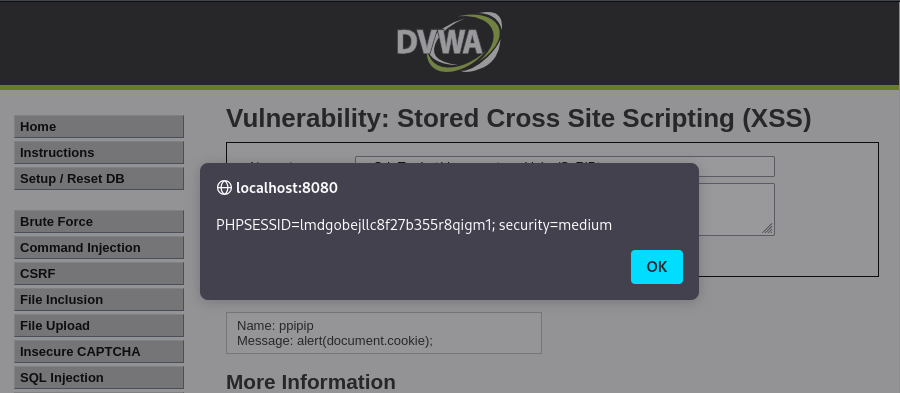

# Ejercicio 12: Stored Cross Site Scripting (XSS) - (Nivel: Medium)

Este módulo trata sobre la vulnerabilidad de XSS persistente (o almacenado), donde el script malicioso se guarda permanentemente en la base de datos del servidor y se ejecuta cada vez que cualquier usuario visita la página afectada.

## 📑 Descripción del Escenario

En el nivel Medium, la aplicación intenta sanear la entrada del usuario en el campo "Message" eliminando o filtrando etiquetas <script>. Sin embargo, el campo "Name" suele tener protecciones más débiles, confiando a veces solo en una limitación de caracteres en el lado del cliente (HTML maxlength).

## 🛠️ Herramientas Utilizadas

- DVWA (Entorno controlado bajo Docker).
- Herramientas de Desarrollador (DevTools): Para modificar atributos del DOM en tiempo real.
- Payloads con variación de mayúsculas/minúsculas: Para evadir filtros de texto sencillos que buscan cadenas exactas.

## 🚀 Ejecución del Ataque

El objetivo es almacenar un script que muestre las cookies de sesión de todo aquel que cargue el libro de visitas (Guestbook).

### 1. Bypass de la limitación de caracteres

El campo "Name" tiene un límite de caracteres que impide escribir un payload completo.

- Acción: Hacemos clic derecho en el campo "Name" -> "Inspeccionar".
- Modificación: Cambiamos el valor de maxlength="10" (o similar) por maxlength="100" para permitir la entrada de nuestro script.

### 2. Payload utilizado

Para evadir el filtro que busca la etiqueta <script> en minúsculas, alternamos el uso de mayúsculas:

```
<sCrIpT>alert(document.cookie);</ScRiPt>
```

### 3. Proceso paso a paso

- Seleccionamos el nivel de seguridad Medium.
- Modificamos el maxlength del campo "Name" mediante las DevTools.
- Introducimos el payload en el campo "Name" y cualquier texto en "Message".
- Al pulsar "Sign Guestbook", el script se guarda en la base de datos.
- Cada vez que se recargue la página, el navegador ejecutará el script almacenado.

## 📸 Evidencia de Explotación

Como se observa en la captura:

- La inyección ha tenido éxito y el script se ha ejecutado al cargar la página.
- Se visualiza la ventana emergente con la información de sesión: PHPSESSID=lmdgobejllc8f27b355r8qigm1; security=medium.
- En la parte inferior, se puede ver que el mensaje fue firmado por "ppipip" con el mensaje malicioso ya procesado por el navegador.

  

## ✅ Conclusión y Mitigación

El XSS almacenado es una de las variantes más peligrosas porque no requiere que la víctima haga clic en un enlace malicioso; basta con que visite una página legítima que contenga el script guardado. Las defensas recomendadas incluyen:

- Sanitización Robusta: No confiar en filtros de "buscar y reemplazar" simples; usar bibliotecas de confianza que limpien el HTML de forma integral.
- Codificación de salida (Output Encoding): Asegurar que los datos provenientes de la base de datos se traten como texto plano al renderizarse.
- Seguridad en capas: Implementar CSP para mitigar el impacto si un script logra ser inyectado.

Recuerda: Este ejercicio cumple con los objetivos del RA3 al detectar y analizar vulnerabilidades en aplicaciones web.